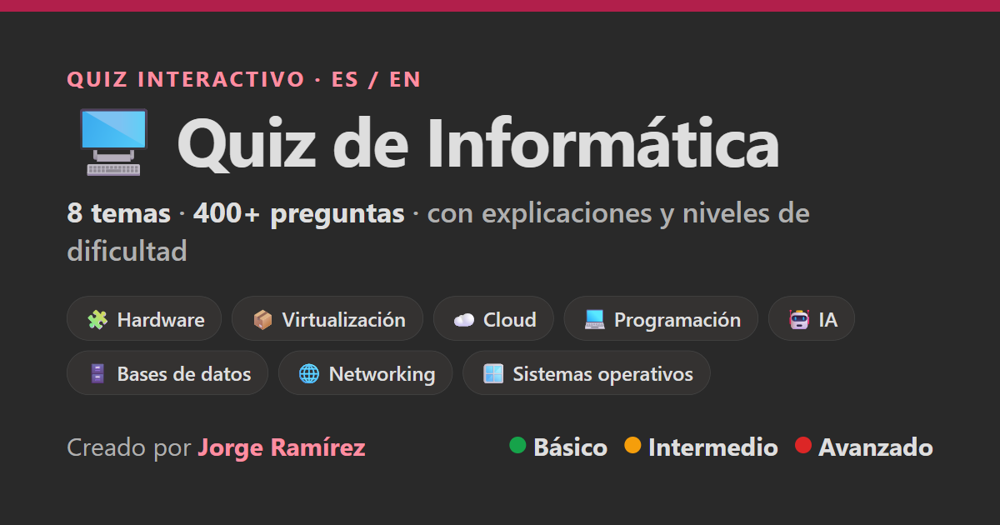

# 🖥️ Quiz de Informática

Quiz interactivo y **gratuito** para dar los primeros pasos en el mundo de la informática. Pensado para estudiantes que empiezan (por ejemplo, un ciclo formativo de informática), pero útil para cualquiera que quiera repasar conceptos base.

**Bilingüe 🇪🇸 / 🇬🇧 · +400 preguntas · 8 temas · 3 niveles de dificultad · funciona sin conexión.**



> 🔗 **Pruébalo aquí:** https://jorgeramirezhr.github.io/Quiz-Informatica/


---

## ✨ Características

- **8 temas**: 🧩 Hardware · 📦 Virtualización · ☁️ Cloud · 💻 Programación · 🤖 Inteligencia Artificial · 🗄️ Bases de datos · 🌐 Networking · 🪟 Sistemas operativos
- **+400 preguntas** de opción múltiple, cada una con:
  - ✅ **Explicación** de la respuesta correcta (tanto si aciertas como si fallas).
  - ❓ **"¿Por qué las demás no?"**: se desmonta cada opción incorrecta.
- **3 niveles de dificultad**: 🟢 Básico · 🟡 Intermedio · 🔴 Avanzado.
- **Bilingüe**: cambia entre 🇪🇸 Español y 🇬🇧 Inglés con un toque.
- **Preguntas y respuestas aleatorias** en cada partida.
- **Diagramas** explicativos (SVG) en conceptos clave.
- **Estadísticas** guardadas en tu navegador: aciertos por categoría y progreso.
- **Modo "Repasar solo mis fallos"** para reforzar lo que peor llevas.
- **Sin conexión**: una vez cargado, funciona offline.
- **Instalable como app** en el móvil (Añadir a pantalla de inicio).

---

## 🚀 Cómo usarlo

- **Online**: abre el enlace de arriba en cualquier navegador.
- **En el móvil (tipo app)**: ábrelo en el navegador → *Compartir* → **Añadir a pantalla de inicio**. Se abrirá a pantalla completa como una aplicación.
- **En local**: descarga `index.html` y ábrelo con un navegador de escritorio (Chrome, Edge, Firefox, Safari).

> ℹ️ En iPhone/iPad, el visor de archivos de iOS no ejecuta JavaScript. Usa el **enlace web** o ábrelo en Safari/Chrome para que funcione.

---

## 🛠️ Tecnología

- **HTML + CSS + JavaScript**, sin frameworks ni dependencias.
- **Un único archivo** (`index.html`) — todo va incluido: preguntas, estilos, lógica e imágenes (SVG en línea).
- **Almacenamiento local** (`localStorage`) para las estadísticas.
- Compatible con navegadores modernos de escritorio y móvil.

---

## 📂 Estructura del proyecto

```
├── index.html            # La aplicación completa (quiz)
├── quiz-social-card.png  # Imagen de portada / vista previa social
└── README.md
```

---

## 🌍 Publicar tu propia copia (GitHub Pages)

1. Haz *fork* o sube los archivos a un repositorio público.
2. **Settings → Pages → Deploy from a branch → main / (root)**.
3. En un minuto tendrás tu URL: `https://TU-USUARIO.github.io/NOMBRE-REPO/`.

---

## 👤 Autor

Creado por **Jorge Ramírez**.

## 📄 Licencia

Este proyecto se publica bajo la licencia **MIT**: puedes usarlo, compartirlo y adaptarlo libremente citando la autoría.
